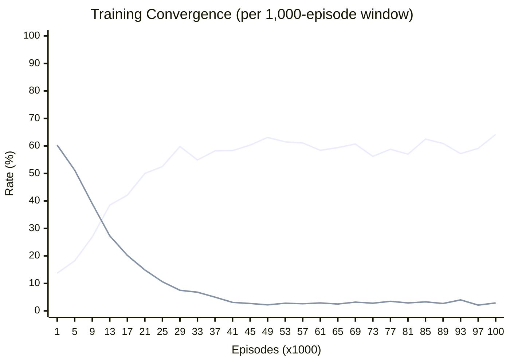
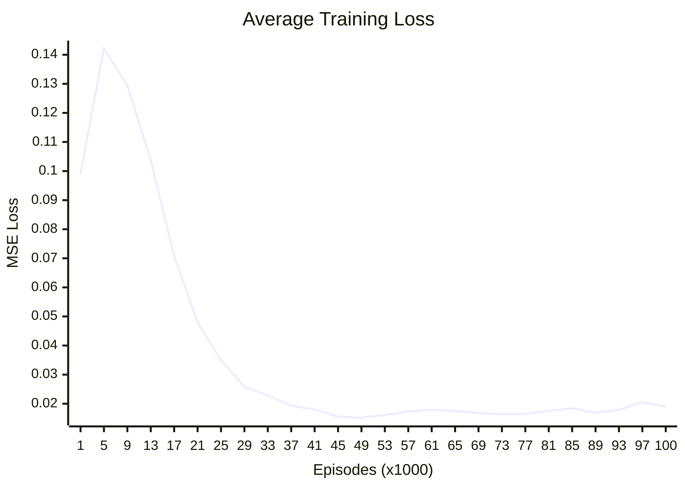

# DQN Training Report

> **Date**: _2026-04-11_
> **Goal**: Train a Deep Q-Network agent for Tic-Tac-Toe
> **Device**: cpu

---

## Training Configuration

| Parameter | Value |
|-----------|-------|
| Total Episodes | 100,000 |
| Learning Rate | 0.001 |
| Discount Factor (gamma) | 0.99 |
| Epsilon (start → end) | 1.0 → 0.01 |
| Batch Size | 64 |
| Buffer Capacity | 50,000 |
| Target Update Freq | Every 500 learn steps |
| Network | MLP: 9 → 128 → 128 → 9 |
| Opponent | Mixed: Random / Self-Play / Alpha-Beta / Hybrid |

---

## Training Curves

### Win/Draw/Loss Rate

### Neural Network Loss

### Detailed Convergence Data

| Episode | Win | Draw | Loss | Avg Loss | Epsilon |
|---------|-----|------|------|----------|---------|
| 1,000 | 26.0% | 13.7% | 60.3% | 0.0992 | 0.9500 |
| 2,000 | 28.1% | 15.4% | 56.5% | 0.1355 | 0.8574 |
| 3,000 | 27.9% | 18.0% | 54.1% | 0.1386 | 0.7738 |
| 4,000 | 30.4% | 16.5% | 53.1% | 0.1397 | 0.6983 |
| 5,000 | 30.6% | 18.2% | 51.2% | 0.1422 | 0.6302 |
| 6,000 | 33.3% | 22.7% | 44.0% | 0.1408 | 0.5688 |
| 7,000 | 33.4% | 25.9% | 40.7% | 0.1390 | 0.5133 |
| 8,000 | 33.1% | 27.5% | 39.4% | 0.1326 | 0.4633 |
| 9,000 | 34.1% | 26.9% | 39.0% | 0.1294 | 0.4181 |
| 10,000 | 35.6% | 30.6% | 33.8% | 0.1252 | 0.3774 |
| 11,000 | 35.6% | 32.8% | 31.6% | 0.1200 | 0.3406 |
| 12,000 | 33.9% | 38.4% | 27.7% | 0.1146 | 0.3074 |
| 13,000 | 34.2% | 38.5% | 27.3% | 0.1037 | 0.2774 |
| 14,000 | 40.3% | 36.7% | 23.0% | 0.0959 | 0.2503 |
| 15,000 | 36.1% | 41.9% | 22.0% | 0.0876 | 0.2259 |
| 16,000 | 38.3% | 39.8% | 21.9% | 0.0774 | 0.2039 |
| 17,000 | 37.7% | 42.1% | 20.2% | 0.0708 | 0.1840 |
| 18,000 | 37.2% | 43.5% | 19.3% | 0.0644 | 0.1661 |
| 19,000 | 37.2% | 46.1% | 16.7% | 0.0577 | 0.1499 |
| 20,000 | 37.1% | 49.2% | 13.7% | 0.0519 | 0.1353 |
| 21,000 | 35.1% | 50.0% | 14.9% | 0.0479 | 0.1221 |
| 22,000 | 35.6% | 50.5% | 13.9% | 0.0442 | 0.1102 |
| 23,000 | 38.5% | 48.8% | 12.7% | 0.0407 | 0.0994 |
| 24,000 | 35.3% | 50.5% | 14.2% | 0.0377 | 0.0897 |
| 25,000 | 36.9% | 52.5% | 10.6% | 0.0350 | 0.0810 |
| 26,000 | 36.0% | 57.0% | 7.0% | 0.0327 | 0.0731 |
| 27,000 | 38.1% | 53.4% | 8.5% | 0.0301 | 0.0660 |
| 28,000 | 36.5% | 55.1% | 8.4% | 0.0279 | 0.0595 |
| 29,000 | 32.7% | 59.8% | 7.5% | 0.0258 | 0.0537 |
| 30,000 | 38.7% | 56.3% | 5.0% | 0.0242 | 0.0485 |
| 31,000 | 35.8% | 58.0% | 6.2% | 0.0233 | 0.0438 |
| 32,000 | 39.3% | 54.1% | 6.6% | 0.0228 | 0.0395 |
| 33,000 | 38.3% | 54.9% | 6.8% | 0.0228 | 0.0356 |
| 34,000 | 36.4% | 57.7% | 5.9% | 0.0217 | 0.0322 |
| 35,000 | 36.9% | 58.5% | 4.6% | 0.0209 | 0.0290 |
| 36,000 | 38.4% | 58.2% | 3.4% | 0.0199 | 0.0262 |
| 37,000 | 36.8% | 58.2% | 5.0% | 0.0193 | 0.0236 |
| 38,000 | 38.9% | 57.9% | 3.2% | 0.0188 | 0.0213 |
| 39,000 | 35.9% | 60.1% | 4.0% | 0.0187 | 0.0193 |
| 40,000 | 35.0% | 62.4% | 2.6% | 0.0180 | 0.0174 |
| 41,000 | 38.6% | 58.3% | 3.1% | 0.0180 | 0.0157 |
| 42,000 | 38.0% | 58.5% | 3.5% | 0.0173 | 0.0142 |
| 43,000 | 36.6% | 60.8% | 2.6% | 0.0166 | 0.0128 |
| 44,000 | 36.2% | 60.7% | 3.1% | 0.0161 | 0.0115 |
| 45,000 | 37.0% | 60.3% | 2.7% | 0.0155 | 0.0104 |
| 46,000 | 38.2% | 60.8% | 1.0% | 0.0154 | 0.0100 |
| 47,000 | 36.4% | 61.8% | 1.8% | 0.0152 | 0.0100 |
| 48,000 | 38.4% | 58.9% | 2.7% | 0.0151 | 0.0100 |
| 49,000 | 34.7% | 63.1% | 2.2% | 0.0152 | 0.0100 |
| 50,000 | 33.6% | 63.6% | 2.8% | 0.0149 | 0.0100 |
| 51,000 | 40.0% | 57.8% | 2.2% | 0.0153 | 0.0100 |
| 52,000 | 37.8% | 58.3% | 3.9% | 0.0158 | 0.0100 |
| 53,000 | 35.7% | 61.5% | 2.8% | 0.0161 | 0.0100 |
| 54,000 | 39.4% | 58.1% | 2.5% | 0.0165 | 0.0100 |
| 55,000 | 36.2% | 60.5% | 3.3% | 0.0162 | 0.0100 |
| 56,000 | 40.2% | 55.9% | 3.9% | 0.0173 | 0.0100 |
| 57,000 | 36.3% | 61.1% | 2.6% | 0.0173 | 0.0100 |
| 58,000 | 37.5% | 59.2% | 3.3% | 0.0170 | 0.0100 |
| 59,000 | 36.8% | 60.5% | 2.7% | 0.0175 | 0.0100 |
| 60,000 | 36.8% | 60.3% | 2.9% | 0.0177 | 0.0100 |
| 61,000 | 38.7% | 58.4% | 2.9% | 0.0179 | 0.0100 |
| 62,000 | 37.5% | 59.6% | 2.9% | 0.0172 | 0.0100 |
| 63,000 | 37.1% | 58.8% | 4.1% | 0.0177 | 0.0100 |
| 64,000 | 36.7% | 59.4% | 3.9% | 0.0176 | 0.0100 |
| 65,000 | 38.1% | 59.4% | 2.5% | 0.0175 | 0.0100 |
| 66,000 | 40.3% | 56.8% | 2.9% | 0.0171 | 0.0100 |
| 67,000 | 38.5% | 59.7% | 1.8% | 0.0167 | 0.0100 |
| 68,000 | 37.1% | 60.0% | 2.9% | 0.0168 | 0.0100 |
| 69,000 | 36.1% | 60.7% | 3.2% | 0.0168 | 0.0100 |
| 70,000 | 38.9% | 58.8% | 2.3% | 0.0165 | 0.0100 |
| 71,000 | 36.1% | 61.7% | 2.2% | 0.0166 | 0.0100 |
| 72,000 | 36.9% | 60.4% | 2.7% | 0.0164 | 0.0100 |
| 73,000 | 41.0% | 56.2% | 2.8% | 0.0164 | 0.0100 |
| 74,000 | 38.1% | 59.5% | 2.4% | 0.0162 | 0.0100 |
| 75,000 | 37.9% | 59.7% | 2.4% | 0.0156 | 0.0100 |
| 76,000 | 39.1% | 58.0% | 2.9% | 0.0160 | 0.0100 |
| 77,000 | 37.7% | 58.8% | 3.5% | 0.0165 | 0.0100 |
| 78,000 | 35.3% | 61.0% | 3.7% | 0.0171 | 0.0100 |
| 79,000 | 37.8% | 60.2% | 2.0% | 0.0170 | 0.0100 |
| 80,000 | 37.6% | 60.0% | 2.4% | 0.0169 | 0.0100 |
| 81,000 | 40.1% | 57.0% | 2.9% | 0.0175 | 0.0100 |
| 82,000 | 38.3% | 57.7% | 4.0% | 0.0175 | 0.0100 |
| 83,000 | 36.8% | 60.4% | 2.8% | 0.0181 | 0.0100 |
| 84,000 | 37.2% | 58.2% | 4.6% | 0.0186 | 0.0100 |
| 85,000 | 34.2% | 62.5% | 3.3% | 0.0184 | 0.0100 |
| 86,000 | 37.4% | 60.5% | 2.1% | 0.0188 | 0.0100 |
| 87,000 | 40.9% | 56.9% | 2.2% | 0.0179 | 0.0100 |
| 88,000 | 37.8% | 59.8% | 2.4% | 0.0173 | 0.0100 |
| 89,000 | 36.4% | 60.9% | 2.7% | 0.0169 | 0.0100 |
| 90,000 | 37.3% | 59.4% | 3.3% | 0.0171 | 0.0100 |
| 91,000 | 37.9% | 58.3% | 3.8% | 0.0177 | 0.0100 |
| 92,000 | 37.6% | 59.2% | 3.2% | 0.0178 | 0.0100 |
| 93,000 | 38.8% | 57.2% | 4.0% | 0.0179 | 0.0100 |
| 94,000 | 38.0% | 58.5% | 3.5% | 0.0186 | 0.0100 |
| 95,000 | 37.1% | 58.1% | 4.8% | 0.0199 | 0.0100 |
| 96,000 | 38.2% | 58.2% | 3.6% | 0.0210 | 0.0100 |
| 97,000 | 38.8% | 59.1% | 2.1% | 0.0205 | 0.0100 |
| 98,000 | 35.1% | 61.5% | 3.4% | 0.0200 | 0.0100 |
| 99,000 | 35.2% | 61.3% | 3.5% | 0.0189 | 0.0100 |
| 100,000 | 32.9% | 64.2% | 2.9% | 0.0190 | 0.0100 |

---

## Validation Results (5,000 games per side)

| Match | Win | Draw | Loss | Status |
|-------|-----|------|------|--------|
| vs Alpha-Beta (as X) | 0 | 5,000 | 0 | PASS |
| vs Alpha-Beta (as O) | 0 | 5,000 | 0 | PASS |
| vs Random (as X) | 4,935 | 65 | 0 | PASS |
| vs Random (as O) | 4,115 | 770 | 115 | FAIL |
| vs Self (as X) | 0 | 5,000 | 0 | PASS |
| vs Self (as O) | 0 | 5,000 | 0 | PASS |

---

## Result: **NOT YET CONVERGED**

The agent has 115 total losses. Neural network approximation may require more training or hyperparameter tuning compared to tabular Q-Learning.

## DQN vs Tabular Q-Learning

| Aspect | Tabular Q-Learning | DQN |
|--------|-------------------|-----|
| State Representation | Exact lookup (3,441 states) | Neural network generalization |
| Scalability | Limited to small state spaces | Can scale to larger games |
| Training Time | ~846s | 845.6s |
| Optimality | Guaranteed (with enough exploration) | Approximate |
