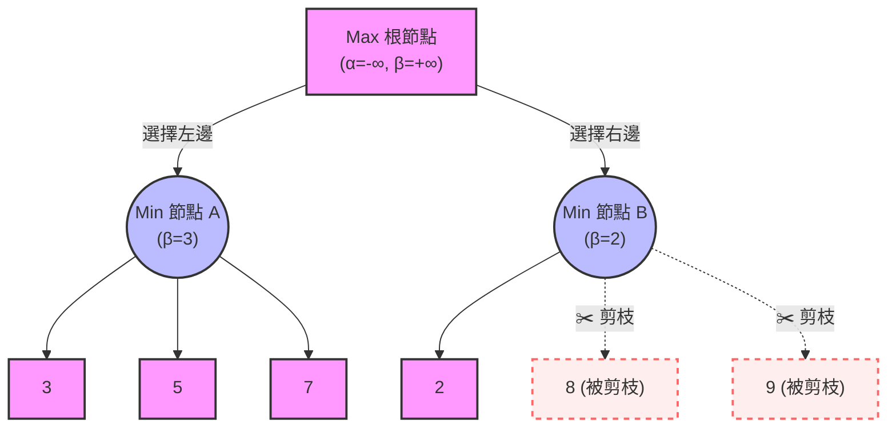

# 📖 深入了解 Alpha-Beta 剪枝法 (Alpha-Beta Pruning)

## 🎒 高中生版：與「討厭鬼朋友」的分蘋果對決

想像一下，你和一個「總愛跟你作對的討厭鬼朋友」在玩一個遊戲。
桌上有好幾個箱子，每個箱子裡裝了幾顆蘋果，蘋果上面寫著分數。

**規則是**：你先選一個箱子，然後討厭鬼朋友會從那個箱子裡挑出**分數最小**的蘋果給你。你的目標是拿到**分數最大**的蘋果！

這個「你想要最大，對手想要最小」的過程，就是所謂的 **Minimax**。

### 為什麼要「剪枝」？（聰明地偷懶）

假設你開始檢查桌上的箱子：
1. **第一個箱子 (A)**：裡面有分數 3、5、7 的蘋果。你朋友是個討厭鬼，他一定會挑 **3** 給你。所以選 A 箱子，你確定自己能拿到 3 分。
2. **第二個箱子 (B)**：你打開一看，第一顆蘋果分數是 **2**。

**🚨 思考一下：你還需要看 B 箱子剩下的蘋果嗎？**

**完全不用！** 因為你的朋友一定會挑最小的給你。既然 B 箱子裡已經出現了 2，你朋友**最多**只會給你 2 分（如果後面有更小的 1，他就會給 1）。
但是，你選 A 箱子已經「保底」能拿到 3 分了！既然 2 已經比 3 小了，B 箱子剩下的蘋果根本不值得看，直接整箱丟掉！

把這個「發現不划算，直接放棄檢查後面選項」的動作，我們就稱為**「剪枝」 (Pruning)**。它讓你在下棋（或找蘋果）時，不用把所有可能性都看完，大幅節省大腦的運算時間。

---

## 🧑‍💻 專業版：Minimax 演算法的終極優化

在機器學習與遊戲 AI 領域，**Alpha-Beta 剪枝法** 是一種搜尋演算法，用來減少 Minimax 演算法在對抗性遊戲樹 (Adversarial Game Tree) 中需要評估的節點數。

### 核心定義
- **Max 玩家 (你)**：想讓得分最大化。
- **Min 玩家 (對手)**：想讓得分最小化。
- **$\alpha$ (Alpha)**：Max 玩家在目前為止所能保證拿到的**最高分數**下限。初始值為 $-\infty$。
- **$\beta$ (Beta)**：Min 玩家在目前為止所能保證拿到的**最低分數**上限。初始值為 $+\infty$。

**核心規則：當 $\alpha \ge \beta$ 時，即觸發剪枝，不再搜索當前節點的其餘子節點。**

---

### 圖解與實際推演例子

以下是一個深度為 2 的博弈樹。正方形代表 Max 玩家（想拿高分），圓形代表 Min 玩家（想給低分）。我們使用 Mermaid 流程圖來視覺化這個過程：

**一步步追蹤 Alpha-Beta 的運作：**

1. **搜索節點 A**：
   - 深入葉節點，評估得到 3, 5, 7。
   - 節點 A 是 Min 玩家，他會選最小值，所以 $A = \min(3, 5, 7) = 3$。
   - 回到根節點 (Max 玩家)，Max 知道走左邊**保底可以拿到 3 分**，於是更新他的最低標準 $\alpha = 3$。

2. **搜索節點 B**：
   - 深入第一個葉節點，評估得到 2。
   - 節點 B (Min 玩家) 此時心中有了一把尺：他知道如果走這邊，他**最多**只會讓 Max 拿到 2 分（此時局部 $\beta = 2$）。
   - 此時，Min 玩家能給出的上限 ($\beta = 2$) 已經小於 Max 玩家的保底標準 ($\alpha = 3$)。滿足了 $\alpha \ge \beta$ 的條件。

3. **✂️ 觸發剪枝**：
   - 根節點 (Max) 的程式邏輯判斷：「我走左邊 A 已經有 3 分了，走右邊 B 對手最多只會給我 2 分。那我根本不可能選 B！」
   - 因此，節點 B 剩下的子節點 `8` 和 `9` 連算都不用算，直接**剪枝** (Pruned) 略過。

---

### 實務上的影響 (效能躍升)

在標準的 Minimax 演算法中，如果樹的深度是 $d$，每個節點的分支數量（可以下的步數）是 $b$，時間複雜度是 $O(b^d)$。

而在理想的情況下（也就是每次搜尋都能先檢查到最好的那一步），Alpha-Beta 剪枝可以將時間複雜度降到 $O(b^{d/2})$。這意味著：**如果原本你的 AI 在有限時間內只能往後算 4 步，加上 Alpha-Beta 剪枝後，它能在同樣的時間內往後算到 8 步！**

這就是為什麼在實作井字遊戲、西洋棋或圍棋等傳統 AI 時，單純的 Minimax 根本跑不動，而必須加上 Alpha-Beta 剪枝技術的原因。
