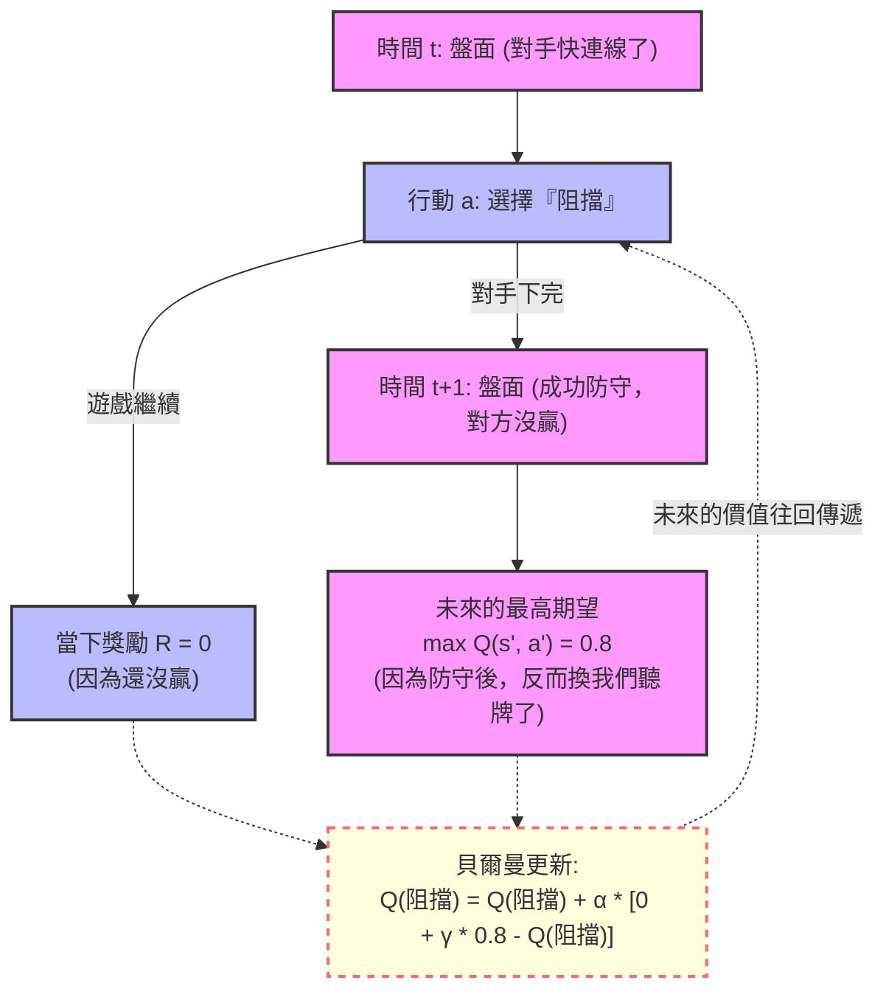

# 📖 深入了解貝爾曼方程式 (Bellman Equation)

**日期：2026-03-22**

## 🎒 高中生版：看透未來的「記仇與報恩」魔法

在強化學習中，有一個非常有名的說法：**「AI 被揍一萬次之後，就會把『必勝』跟『必防』的招式寫進它的筆記本 (`q_table.json`) 裡。」**

到底它是怎麼辦到的？因為它不懂遊戲規則，也沒有人教它。它靠的，就是一個叫做 **貝爾曼方程式 (Bellman Equation)** 的魔法。

### 什麼是貝爾曼方程式？（時光倒流的魔法）

想像你正在玩一個迷宮遊戲，你站在一個路口，可以選擇「左轉」或「右轉」。
1. 你選擇了 **「左轉」**。
2. 左轉的當下，地上什麼都沒有，你沒有得分也沒有扣分。（**當下獎勵 = 0**）
3. 但是左轉之後，你抬頭一看，發現前面一步就是「終點大寶箱」！

如果你是一個很笨的人，你可能會想：「喔，左轉沒拿到分數，左轉是個普通的選擇。」
但 **貝爾曼方程式** 就像是一個會時光倒流的仙人，它會跳出來敲你的頭說：
> 「笨蛋！雖然『左轉』這個動作本身沒分數，但因為它把你帶到了一個『即將拿到 100 分的未來』，所以『左轉』這個動作其實超級值錢！趕快翻開你的筆記本，把『左轉』的分數調高！」

### 在井字遊戲裡怎麼運作？

* **報恩 (學習必勝)**：AI 隨便亂走，不小心走了一步，結果下一步直接連成三條線贏了（獲得 +1 分）。貝爾曼方程式就會把這份未來的喜悅「往回傳遞」，告訴 AI：「你剛剛那步走得太好了！」
* **記仇 (學習必防)**：AI 隨便亂走，結果走完換對手下，對手直接連線把 AI 殺了（獲得 -1 分）。貝爾曼方程式就會把這個痛苦的未來「往回傳遞」，告訴 AI：「你剛剛那步簡直是找死，趕快在筆記本上打個大叉叉，下次絕對不能走！」

就這樣，被揍了一萬次之後，未來的「贏」與「輸」，透過貝爾曼方程式像水波一樣，一圈一圈地往回推算到了開局的第一步。AI 就不再是瞎走的笨蛋，而變成了一代宗師！

---

## 🧑‍💻 專業版：Bellman Equation 的數學解析

在強化學習中，**貝爾曼方程式** 是動態規劃 (Dynamic Programming) 的核心，它定義了「當前狀態的價值」與「未來狀態價值」之間的遞迴關係。

在我們實作的 Q-Learning (查表法) 中，我們使用的是 **貝爾曼最佳方程式 (Bellman Optimality Equation)** 的更新規則：

$$ Q^{new}(s, a) \leftarrow Q^{old}(s, a) + \alpha \left[ \underbrace{R + \gamma \max_{a'} Q(s', a')}_{\text{目標值 (Target)}} - Q^{old}(s, a) \right] $$

### 公式拆解與物理意義

1.  **$s$ (Current State)**: 當前的盤面狀態。
2.  **$a$ (Action)**: AI 決定下的那一步。
3.  **$R$ (Reward)**: 走這步當下獲得的立即獎勵（贏=1，輸=-1，繼續下=0）。
4.  **$s'$ (Next State)**: 走完這步之後，產生的新盤面（在零和賽局中，通常包含對手回應後輪到我們的盤面）。
5.  **$\max_{a'} Q(s', a')$ (Future Value)**: 在未來的盤面 $s'$ 中，我們翻開 Q-Table 能找到的最佳步數的預期分數。

**核心邏輯：**
括號內的 $\left[ R + \gamma \max_{a'} Q(s', a') \right]$ 被稱為 **TD Target (Temporal Difference Target)**。
它代表了：「**眼前的獎勵 + 打折後的未來最高期望獎勵**」。

貝爾曼方程式的本質，就是計算**「現在我以為的分數 ($Q^{old}$)」**與**「真正發生後的目標分數 (Target)」**之間的誤差（TD Error），然後乘上學習率 ($\alpha$)，用來修正我們大腦裡的 Q-Table。

### 圖解：延遲獎勵的傳遞過程

我們用 Mermaid 流程圖來模擬 AI 是如何學會「防守」的：

**結論**：
透過這個機制，即使每一步的即時獎勵都是 0，只有在遊戲結束的那一刻才有 +1 或 -1，貝爾曼方程式也能在成千上萬次的迭代中，將結局的價值完美地「反向傳播 (Backpropagate)」到遊戲的每一個分岔路口。這就是 Q-Learning 能從無到有學會下棋的終極秘密。