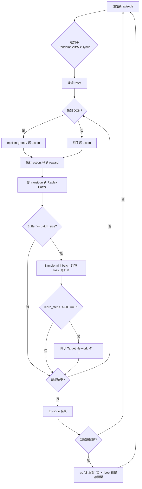

# 深入了解 Deep Q-Network (DQN)：從查表到神經網路

> **日期**: _2026-04-11_
> **前置知識**: [Q-Learning 教學](q_learning_tutorial_2026-03-22.md)、[貝爾曼方程式](bellman_equation_tutorial_2026-03-22.md)

---

## 高中生版：用「直覺」取代「筆記本」

### Q-Learning 的瓶頸

還記得 Q-Learning 嗎？它用一本「筆記本」（Q-Table）記住每個棋盤對應的最佳分數。在井字遊戲中，只有 ~5,000 種盤面，筆記本翻得完。

但想像一下圍棋 — 有 $10^{170}$ 種盤面。就算每秒記一頁，從宇宙誕生記到現在也記不完。**筆記本不夠用了。**

### 神經網路 = 訓練一個「直覺」

DQN 的核心想法：**不要記住每個盤面的分數，而是訓練一個「大腦」來估算分數。**

```
Q-Learning（查筆記本）          DQN（問大腦）
┌──────────────────┐          ┌──────────────────┐
│ 盤面 A → 0.8 分  │          │                  │
│ 盤面 B → 0.3 分  │   →→→    │   神經網路大腦    │
│ 盤面 C → -0.5 分 │          │  「這盤面大概     │
│ ...5,000 頁...   │          │    值 0.7 分吧」  │
└──────────────────┘          └──────────────────┘
  記住每一個               看過類似的，推理出來
```

就像人類棋手：他不會記住每個棋局，而是看了幾萬盤棋之後，一眼就能判斷「這局形勢不錯」。

### 三個關鍵問題與解法

#### 問題 1：學習資料太相關

如果你連續下十盤棋，這十盤的棋局非常相似（因為前幾步一樣）。神經網路會以為「世界就長這樣」，過度擬合。

**解法：Experience Replay（經驗回放）**

把每一步的經驗丟進一個大水池（Buffer），學習時隨機從水池撈。就像考試前不按章節順序複習，而是隨機翻課本，效果更好。

```
經驗水池（50,000 筆）
┌────────────────────────────────────┐
│ 第 3 盤第 2 步: 下在角落，贏了      │
│ 第 87 盤第 4 步: 下在邊邊，輸了     │  ← 隨機撈 64 筆出來學
│ 第 42 盤第 1 步: 下在中間，平手      │
│ ...                                │
└────────────────────────────────────┘
```

#### 問題 2：目標一直在變

Q-Learning 的目標公式是：

> 目標 = 眼前獎勵 + 未來最高分數

但「未來最高分數」是由**同一個正在學習的網路**算出來的。網路更新 → 目標改變 → 網路又要重新學 → 目標又改變... 就像追逐自己的影子。

**解法：Target Network（目標網路）**

準備兩個一模一樣的網路：
- **Policy Network**（學習中的網路）：每一步都在更新
- **Target Network**（凍結的舊網路）：定期從 Policy 複製，其餘時間不動

```
Policy Network（一直在學）  ──── 每 500 步複製 ────→  Target Network（凍結的）
      │                                                    │
      ▼                                                    ▼
  「我覺得這步值 0.7」                              「未來最高大概 0.8」
                                                           │
                              ◄────── 算出穩定的目標 ───────┘
```

#### 問題 3：先手/後手看到的棋盤不同

你是 X（先手）看到的是「我的棋子是 1」，你是 O（後手）看到的是「我的棋子是 -1」。

**解法：Board Normalization（棋盤正規化）**

不管你是 X 還是 O，都把棋盤翻轉成「我是 1，對手是 -1」。一個大腦服務兩個視角。

```
實際棋盤（我是 O）:     正規化後（Q-table key）:
 X | O | .               O | X | .
 . | X | .      →→→      . | O | .
 . | . | O               . | . | X
 (我=-1, 對手=1)         (我=1, 對手=-1)
```

### 實際效果

我們的 DQN 在井字遊戲上的成績：

| 對手 | 結果 |
|------|------|
| Alpha-Beta（完美對手） | **零敗**（全部平手） |
| Random（亂下的） | 先手零敗，後手偶爾輸 (~2.5%) |
| 自己 | 全部平手 |

vs Random 後手偶爾輸，是因為神經網路靠「推理」而不是「記憶」。面對非常罕見的怪盤面，推理可能不夠精確。但這正是 DQN 的設計取捨：**用少量的不完美，換取處理超大棋盤的能力**。

---

## 專業版：DQN 演算法深度解析

### 演算法定義

Deep Q-Network (DQN) 使用 neural network $Q(s, a; \theta)$ 逼近最佳 action-value function $Q^*(s, a)$，取代 tabular Q-Learning 的 dictionary lookup。

**核心公式（Bellman Target）：**

$$y_i = r_i + \gamma \max_{a'} Q(s'_i, a'; \theta^{-})$$

其中 $\theta^{-}$ 為 target network 的參數（定期從 $\theta$ 複製）。

**Loss function（MSE）：**

$$L(\theta) = \frac{1}{N}\sum_{i=1}^{N}(Q(s_i, a_i; \theta) - y_i)^2$$

### 網路架構

```
Input Layer (9)         ← 3×3 棋盤攤平，經 board normalization
    │
    ▼
Linear(9, 128) + ReLU  ← Hidden Layer 1: 學習棋型特徵
    │
    ▼
Linear(128, 128) + ReLU ← Hidden Layer 2: 學習特徵組合
    │
    ▼
Linear(128, 9)          ← Output: 每個 action 的 Q-value
    │
    ▼
Illegal Action Mask     ← 非法位置設為 -∞，取 argmax
```

參數量：$(9 \times 128 + 128) + (128 \times 128 + 128) + (128 \times 9 + 9) = 18,441$

### Experience Replay

維護一個固定大小的 circular buffer $\mathcal{D}$（capacity = 50,000），儲存 transition tuple：

$$(s, a, r, s', \text{done}, \text{legal\_actions'})$$

每次 learn step 從 $\mathcal{D}$ 中 uniform random sample 一個 mini-batch（size = 64）。

**效果：**
1. 打破 temporal correlation（連續 transition 高度相關）
2. 提高 data efficiency（每筆經驗可被多次抽樣學習）
3. 平滑化 training distribution

### Target Network

維護兩組網路參數：

| 網路 | 參數 | 更新頻率 | 用途 |
|------|------|----------|------|
| Policy Network | $\theta$ | 每個 learn step | 選 action、計算 $Q(s, a; \theta)$ |
| Target Network | $\theta^{-}$ | 每 500 learn steps | 計算 target $\max_{a'} Q(s', a'; \theta^{-})$ |

同步方式為 hard copy：$\theta^{-} \leftarrow \theta$

**為什麼需要：** 若用同一個網路計算 current Q 和 target Q，更新 $\theta$ 會同時改變 target，導致 training oscillation 或 divergence。

### 訓練流程



### 訓練配置

| Parameter | Value | 說明 |
|-----------|-------|------|
| Episodes | 100,000 | 總訓練場數 |
| Learning Rate | $10^{-3}$ | Adam optimizer |
| $\gamma$ (discount) | 0.99 | 高度重視未來獎勵 |
| $\epsilon$ | $1.0 \to 0.01$ | 探索率衰減 (×0.95 per 500 eps) |
| Batch Size | 64 | Mini-batch 大小 |
| Buffer | 50,000 | Replay buffer 容量 |
| Target Sync | 500 steps | Hard copy 頻率 |
| Gradient Clip | max_norm=1.0 | 防止梯度爆炸 |
| Reward | Win=1.0, Draw=0.5, Loss=-1.0 | |

### DQN vs Tabular Q-Learning：深度對比

| 面向 | Tabular Q-Learning | DQN |
|------|-------------------|-----|
| 表徵 | Exact: $Q[s][a] \in \mathbb{R}$ | Approximate: $Q(s,a;\theta) \approx Q^*(s,a)$ |
| 收斂保證 | 有（在 tabular MDP + 足夠探索下） | 無嚴格保證（function approximation + bootstrapping） |
| 狀態覆蓋 | 必須造訪每個 state | 可泛化到未見過的 state |
| 記憶體 | $O(\|S\| \times \|A\|)$ | $O(\|\theta\|)$，與狀態數無關 |
| 井字遊戲結果 | **零敗**（3,441 states 全記住） | vs Random 後手 ~2.5% 敗率（泛化的代價） |
| 可擴展性 | 僅限 $\|S\| < 10^4$ | 可處理 $\|S\| > 10^{100}$（如圍棋） |

### 為什麼 DQN vs Random 後手會輸？

**根本原因：Function Approximation Error**

Neural network 是 smooth function — 對 input space 做連續映射。當 Random 對手走出訓練中極少見到的棋步序列時，網路的 Q-value 估計可能不夠精確，導致選了次佳 action。

Tabular 方法不存在這個問題：每個 state 有獨立的 entry，不會互相干擾。

**可能的改善方向：**

| 方法 | 原理 |
|------|------|
| 增加 Random 對手比例 | 讓 buffer 包含更多 rare states |
| D4 Symmetry Augmentation | 每筆 transition 擴展為 8 筆（旋轉/翻轉） |
| Prioritized Experience Replay | 根據 TD-error 加權抽樣，專注學「會輸的情況」 |
| 更多訓練 (200K+) | 提高 rare states 出現頻率 |

### 參考資料

1. Mnih, V. et al. (2015). *Human-level control through deep reinforcement learning*. Nature, 518(7540), 529-533. — DQN 原始論文
2. Mnih, V. et al. (2013). *Playing Atari with Deep Reinforcement Learning*. arXiv:1312.5602 — DQN 的前身，首次將 deep learning 用於 RL
3. [PyTorch DQN Tutorial](https://pytorch.org/tutorials/intermediate/reinforcement_learning_dqn_tutorial.html) — 官方教學
