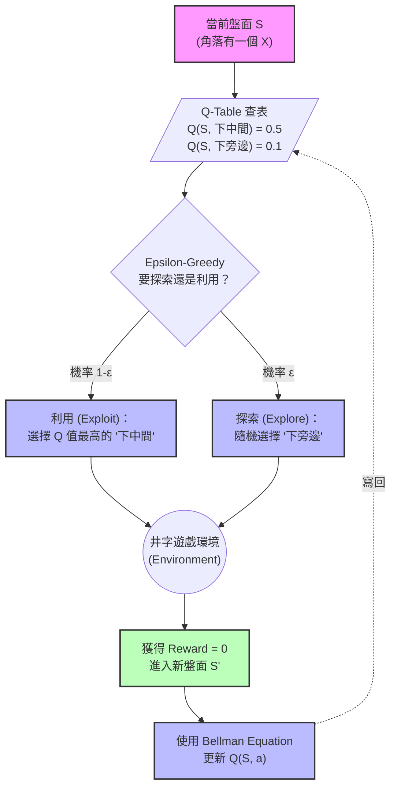

# 📖 深入了解 Q-Learning 演算法 (Tabular Q-Learning)

**日期：2026-03-22**

## 🎒 高中生版：不會下棋的小白，如何靠「記仇與報恩」變成大師？

想像你有一個朋友叫「小 Q」，他是一個**完全不懂井字遊戲規則**的人。他不知道三個連成一線會贏，甚至不知道圈圈和叉叉代表什麼。

但他有一個超能力：**他有一本超級無敵大的筆記本**。

每次輪到他走的時候，他會做以下的事情：
1. **看盤面 (State)**：看看現在桌上的圈圈叉叉長怎樣。
2. **翻筆記本查表**：找找看有沒有哪一頁畫著一模一樣的盤面。
    * 如果那一頁寫著：「走中間那格，後來我贏了（得到 +1 分）」。他就會毫不猶豫地走中間。
    * 如果那一頁是空白的，他就**閉著眼睛隨便亂走一個空格 (Exploration，探索)**。
3. **記下結果 (Reward)**：
    * 如果他隨便走一步，最後結果竟然**贏了**！他就會開心地翻回剛剛那一頁，把那一步的分數寫高一點（報恩）。
    * 如果他走了某一步，後來被對手反殺**輸了**，他就會立刻翻回那一頁，在那一步打個大大的叉，並扣分（記仇）。

就這樣，小 Q 一開始一直輸、一直輸（因為都在亂走）。但是下了 10,000 盤之後，他的筆記本上紀錄了所有盤面的「必勝套路」跟「必死陷阱」。這時候，他再也不亂走了，只要翻開筆記本照著最高分下，他就成了井字遊戲大師！

這個過程，就是所謂的 **強化學習 (Reinforcement Learning)**。而那本筆記本，就是 **Q-Table**。

---

## 🧑‍💻 專業版：Tabular Q-Learning 核心解析

Q-Learning 是一種 **Model-Free (無模型)** 且 **Off-Policy (離線策略)** 的強化學習演算法。
在井字遊戲中，狀態空間 (State Space) 足夠小（只有幾千種合法盤面），因此我們可以用一張表格（Dictionary/Hash Map）來儲存所有狀態下所有動作的預期價值，也就是 **Q-Value**。

### 核心公式：貝爾曼方程式 (Bellman Equation)

每一次 Agent 下了一步，得到環境的回饋 (Reward) 後，它會用以下的公式來更新 Q-Table 裡的分數：

$$ Q(s, a) \leftarrow Q(s, a) + \alpha \left[ R + \gamma \max_{a'} Q(s', a') - Q(s, a) \right] $$

**符號解釋：**
*   $s$ (State)：下棋前的盤面狀態。
*   $a$ (Action)：我們選擇下的那一步。
*   $R$ (Reward)：下這步後，環境給的獎勵（例如：贏了給 +1，輸了給 -1，還在下給 0）。
*   $s'$ (Next State)：下完這步，並且對手也回應之後的新盤面。
*   $\max_{a'} Q(s', a')$：在未來的那個新盤面下，我們能查到的「最高預期分數」。
*   $\alpha$ (Learning Rate)：學習率。這一次的驚喜/驚嚇，要多大程度地覆蓋掉舊記憶？
*   $\gamma$ (Discount Factor)：折扣因子。未來的獎勵沒有眼前的獎勵香，所以要打個折。

### 圖解流程與實際例子

我們用 Mermaid 流程圖來看看 Agent 的大腦是如何運作的：

**💡 實際例子 (延遲獎勵的傳遞)：**

假設今天 Agent 下了一步「防守」，這步本身沒有得分 ($R=0$)。
但是因為這步防守，到了**下一步 (Next State $s'$)**，它發現自己剛好可以連成三條線獲勝！
此時 $\max_{a'} Q(s', a') = 1$。

透過貝爾曼方程式：
$$ Q(防守) = Q(防守) + \alpha \times \left( 0 + 0.9 \times 1 - Q(防守) \right) $$

原本「防守」這個動作 Q 值可能是 0，但透過這個公式，未來的勝利（1分）被打九折（0.9）之後，往回傳遞給了「防守」這個動作。
這就是為什麼 Agent 不需要人教，只要自己跟自己下個幾萬盤，未來勝利的喜悅就會像漣漪一樣，慢慢往回傳遞到開局的第一步！
