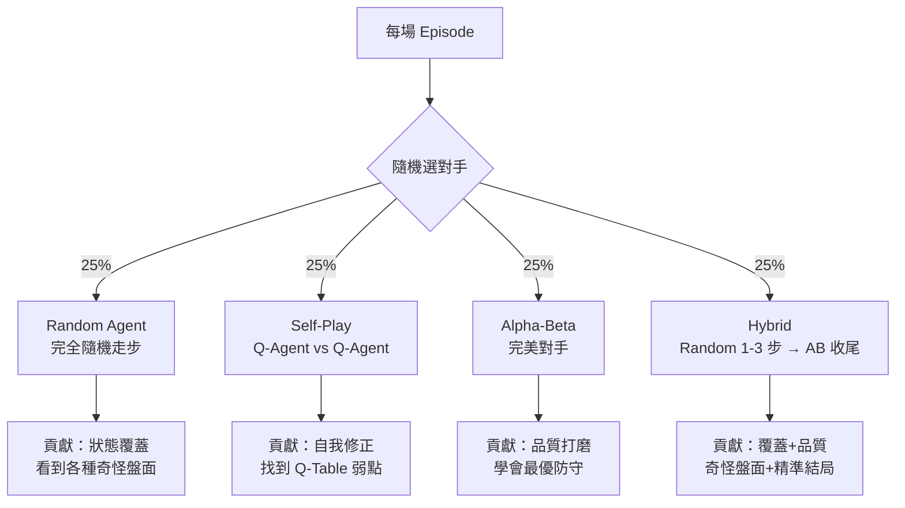
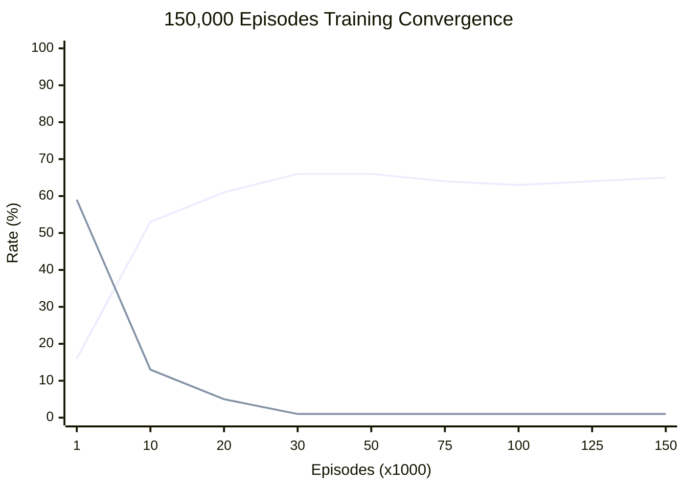

# 從零到不敗：Q-Learning 如何學會井字遊戲的完美策略

**日期：_2026-03-28_**

本文記錄如何讓一個 Tabular Q-Learning Agent 從完全不懂規則，透過 15 萬場訓練達到「跟誰下都不會輸」的不敗水準。涵蓋三個關鍵技術：**棋盤正規化 (Board Normalization)**、**混合對手訓練 (Mixed Opponent Training)**、**D4 對稱查表 (D4 Symmetry Lookup)**。

---

## 1. 棋盤正規化：一張表打天下

### 高中生版

想像你學了「先手下中間最好」，但下一盤你變成後手了——你的筆記本上全是先手的經驗，完全派不上用場。

**解法**：每次打開筆記本之前，先把棋盤「翻過來」——把對手的棋子當成自己的、自己的棋子當成對手的。這樣不管你是先手還是後手，你看到的都是「我是 1 號玩家」的世界。一本筆記本就夠了！

### 專業版

Q-Table 的 key 是棋盤狀態的字串表示。當 agent 為 player -1 (O) 時，將觀測值乘以 -1 再查表：

$$Q(s, a) \to Q(-s, a)$$

實作位於 `q_learning_agent.py` 的 `_normalize_obs()` 方法：

```python
def _normalize_obs(self, observation: np.ndarray) -> np.ndarray:
    if self.player == 1:
        return observation
    return observation * -1
```

### 具體範例

```
實際棋盤 (我是 O=-1):        正規化後 (查表用):
 X | O | .                    O | X | .
 . | X | .         →          . | O | .
 . | . | O                    . | . | X
[1,-1,0,0,1,0,0,0,-1]        [-1,1,0,0,-1,0,0,0,1]
                               ↑ 乘以 -1，我永遠是 "1"
```

**效果**：先手與後手的訓練資料貢獻到同一張 Q-Table，等於訓練量翻倍。

---

## 2. 混合對手訓練：覆蓋 + 品質

### 高中生版

如果你只跟一個固定套路的大師練棋，你會把那幾盤背得滾瓜爛熟，但換一個亂下的對手就慌了——你從來沒見過那些奇怪的盤面。

**解法**：每天隨機挑一個對手練習——有時候跟亂下的新手（見世面），有時候跟自己打（找弱點），有時候跟大師打（磨品質），有時候前半段亂打、後半段大師接手（奇怪盤面 + 精準評價）。

### 專業版

每場 episode 隨機選擇對手類型（各 25%）：



| 對手 | 狀態覆蓋 | Reward 品質 | 角色 |
|------|----------|-------------|------|
| Random | 高 (走步多樣) | 低 (噪音大) | 拓展視野 |
| Self-Play | 中 (自我演化) | 中 (取決於自身水準) | 找漏洞 |
| Alpha-Beta | 低 (確定性回應) | 高 (完美評價) | 磨品質 |
| Hybrid | 高 (Random 開局) | 高 (AB 收尾) | 兩全其美 |

### 為什麼 Hybrid 最有效

純 Alpha-Beta 訓練的問題：AB 是確定性的——同一盤面永遠下同一步。不管打幾萬場，Q-Agent 只能見到 ~165 種盤面（被鎖死在 AB 的固定回應路徑裡）。

Hybrid 的解法：Random 前幾步製造多樣的中盤局面，AB 接手確保 reward 反映真實的局面價值。

```
Hybrid Episode 範例:

Step 1: 對手 (Random) 走格 7       ← 亂走，製造罕見盤面
Step 2: Q-Agent 走格 4
Step 3: 對手 (Random) 走格 0       ← 繼續亂走
Step 4: Q-Agent 走格 2
Step 5: 對手 (Alpha-Beta 接手) 走格 6  ← 完美收尾
Step 6: Q-Agent 走格 8
Step 7: 對手 (Alpha-Beta) 走格 1
→ 結果: Draw (+0.5)               ← 精準的 reward 信號
```

---

## 3. D4 對稱查表：轉一轉就能用

### 高中生版

你的筆記本上有一頁寫著：

```
X . .
. O .     →  下左下角 (格6) 最好，0.8 分
. . .
```

現在你遇到一個盤面：

```
. . .
. O .     ←  這頁你沒背過！
. . X
```

但仔細看——這不就是把原來那頁旋轉 180° 嗎！所以「下右上角 (格2)」就等於原來的「下左下角 (格6)」。

**解法**：每次查筆記本，如果找不到，就把盤面轉一轉、翻一翻（共 8 種方式），看有沒有哪一種在筆記本裡。

### 專業版

正方形有 8 種保持形狀不變的剛體運動，構成 **二面體群 D4 (Dihedral Group D4)**：

$$D_4 = \langle r, s \mid r^4 = s^2 = e,\ srs = r^{-1} \rangle, \quad |D_4| = 8$$

其中 $r$ 是 90 度旋轉，$s$ 是水平翻轉。

```
原始:    旋90:    旋180:   旋270:
0 1 2    6 3 0    8 7 6    2 5 8
3 4 5    7 4 1    5 4 3    1 4 7
6 7 8    8 5 2    2 1 0    0 3 6

水平翻:  90+翻:   180+翻:  270+翻:
2 1 0    0 3 6    6 7 8    8 5 2
5 4 3    1 4 7    3 4 5    7 4 1
8 7 6    2 5 8    0 1 2    6 3 0
```

實作需要兩組映射表：

- **action_map**: `transformed_obs = original_flat[action_map]` — 將原始盤面變換到目標空間
- **inverse_map**: `inverse_map[original_action] = transformed_action` — 將原始座標的動作轉換到目標空間查 Q-Table

```python
# 查表流程 (q_learning_agent.py 的 act())
for action_map, inverse_map in _SYMMETRY_MAPS:  # 8 種變換
    state_key = str(original_flat[action_map].tolist())

    if state_key not in self.q_table:
        continue  # 這個變換沒命中，試下一個

    # 命中！用這個變換的 Q 值選動作
    for action in legal_actions:
        q_value = Q[state_key][str(inverse_map[action])]
        # 選 Q 值最高的 action
```

**效果**：3,441 種已學狀態 x 8 種對稱 = 等效覆蓋 ~27,000 種，遠超全部 ~5,000 種合法狀態。實測遇到 unseen state 的機率趨近於零。

---

## 4. 訓練成果

### 收斂過程



| 階段 | Episodes | Epsilon | Loss Rate | Q-Table |
|------|----------|---------|-----------|---------|
| 早期 | 0-10K | 0.30→0.12 | 59%→13% | 快速學到 ~3,000 狀態 |
| 中期 | 10K-33K | 0.12→0.01 | 13%→1% | 穩定學習最佳應對 |
| 後期 | 33K-150K | 0.01 | ~1% | 微調 Q 值，3,441 狀態 |

### 最終驗證

| 對手 | 先手 (X) | 後手 (O) | 結果 |
|------|----------|----------|------|
| vs Alpha-Beta | 5,000 平 / 0 敗 | 5,000 平 / 0 敗 | PASS |
| vs Random | 4,858 勝 142 平 / 0 敗 | 3,600 勝 1,400 平 / 0 敗 | PASS |
| vs Self | 5,000 平 / 0 敗 | 5,000 平 / 0 敗 | PASS |

### 效能比較 (Single vs Parallel)

| 指標 | 單核 | 16 核平行 |
|------|------|-----------|
| 耗時 | 8.95s | 1.42s |
| 加速比 | 1.0x | **6.3x** |
