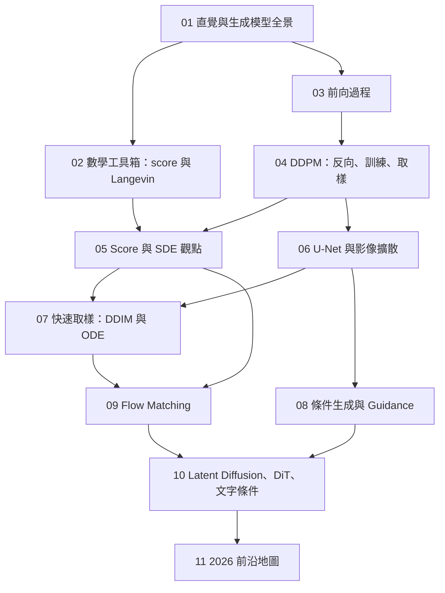

# 第 00 課：課程地圖與環境設定

> 撰寫日期：2026-09-25 ｜ 本課沒有實驗 ｜ 預估閱讀時間：15 分鐘

## 這門課要帶你走到哪裡

讀完、做完這門課，你應該能：

1. **從第一原理推出 DDPM**：前向加噪的封閉解、反向後驗、ELBO 為什麼最後只剩一個 MSE。
2. **用三種語言講同一件事**：變分（VAE 式）、score／SDE、flow／ODE，並能在三者之間換算 $\epsilon$、$x_0$、score、velocity。
3. **自己手刻並訓練**：2D 玩具資料、MNIST 上的 DDPM、DDIM、classifier-free guidance、flow matching、小型 DiT，全部在 CPU 上跑得動。
4. **看懂 2026 年的論文與產品**：Stable Diffusion 3／FLUX 為什麼是「rectified flow ＋ Transformer」、少步生成怎麼做、文字擴散模型在做什麼。

## 先備知識

| 需要 | 程度 | 不熟怎麼辦 |
|---|---|---|
| PyTorch | 會寫 training loop、`nn.Module` | repo 裡的 `deep-learning-karpathy/`（nanoGPT）就是很好的熱身 |
| 機率 | 期望值、條件機率、貝氏定理、常態分布 | 第 02 課會把需要的工具整理一次 |
| 微積分／線代 | 梯度、鏈鎖律、向量內積 | 夠用即可，不需要測度論 |
| 深度學習 | CNN、attention、LayerNorm | 第 06、10 課會補架構細節 |

不需要先懂 SDE、變分推論或最佳傳輸——課程會從白話開始講。

## 課程地圖



三條主線：

- **變分主線**（01 → 03 → 04）：把擴散當成一個很深的 VAE，推出 DDPM 的損失函數。
- **score 主線**（02 → 05）：把擴散當成「學習資料分布的梯度場」，接上物理的 Langevin 與 SDE。
- **flow 主線**（05 → 07 → 09）：把生成看成解一條 ODE，引出 DDIM、flow matching、rectified flow。

第 06、08、10 課把這些接到真正的影像模型上，第 11 課是延伸閱讀地圖。

## 每一課長什麼樣

每課都照同一個順序（沿用本 repo 的「雙層講解」）：

1. **白話版**：先用高中生聽得懂的比喻建立直覺。
2. **正式版**：推導與定義，公式都有編號、都能在程式裡找到對應。
3. **對照程式碼**：指到 `src/diffusion_course/` 的哪個函式、哪一行在做這件事。
4. **常見誤解**：自學最容易卡住的地方。
5. **練習**：分成「想一想」（紙筆）與「動手改」（改 notebook）。
6. **延伸閱讀**：一手論文為主，完整清單在 [`../references.md`](../references.md)。

## 建議的學習節奏

| 週 | 課 | 重點 |
|---|---|---|
| 1 | 00–03 | 把直覺與前向過程弄熟；跑 lab 02、03 |
| 2 | 04–05 | 這兩課最吃重：推導 DDPM 損失、看懂 score 與 SDE |
| 3 | 06–08 | 影像實作：U-Net、DDIM、guidance（lab 06 要先跑，lab 07 會用到它的權重） |
| 4 | 09–11 | flow matching、DiT、前沿論文 |

每課約 1.5–3 小時（閱讀＋實驗＋練習）。推導那幾課（04、05、09）建議拿紙筆跟著算一遍。

## 環境設定

照 repo 規則（`AGENTS.md` §5）：每個子專案獨立 `.venv`，套件由本人手動 `uv add`。
`pyproject.toml` 已經把 `torch`／`torchvision` 導向 PyTorch 的 CUDA 12.6 wheel 索引，所以同一組指令在 Windows 與 Linux 都會裝到 GPU 版：

```bash
cd diffusion-models-course
uv add torch torchvision numpy matplotlib loguru ipykernel
uv add --dev pytest
uv run pytest                # 基線：全部測試應該通過
```

然後用 VS Code（或 Jupyter）打開 `notebooks/`，kernel 選本子專案的 `.venv`。
MNIST 第一次用到時會自動下載到 `data/`（約 60 MB，已在 `.gitignore`）。

**硬體**：所有實驗都能在 CPU 上跑。notebook 裡的輸出是在 4 核心雲端 CPU 上實跑的結果：不訓練影像模型的實驗（02–05、09）每個不到 4 分鐘，MNIST 實驗（06–08、10）每個 7–30 分鐘，最久的是 Lab 06（訓練約 16 分鐘，加上 1000 步取樣）。
有 GPU 的話，把每個 notebook 開頭的步數常數調大，品質會明顯變好；更長的訓練用 `scripts/train_mnist.py`（用法見 [`../README.md`](../README.md)）。

## 程式碼怎麼讀

`src/diffusion_course/` 是整門課的參考實作，每個 notebook 都直接 import 它。
**所有模型共用同一個呼叫介面** `model(x, t, y)`：

- `x`：帶雜訊的樣本（2D 點或影像）
- `t`：時間，一律是 $[0, 1)$ 的浮點數（DDPM 的整數步 $i$ 會先換成 $i / T$）
- `y`：可選的類別標籤；`None` 表示無條件

因為介面一致，DDPM、DDIM、flow matching 的取樣器和 classifier-free guidance 的包裝器可以任意組合。
`tests/` 裡的測試大多是「拿封閉解來對答案」，例如：資料只有一個點時，最佳去噪器可以寫成公式，用它跑取樣器必須剛好回到那個點。讀測試也是一種學習。

## 符號約定

完整符號表在 [附錄 A](A_notation.md)。最重要的一條先講：

> **不同論文的時間方向不一樣。** DDPM 裡 $x_0$ 是資料、$x_T$ 是雜訊；flow matching（Lipman 等人）裡 $t=0$ 是雜訊、$t=1$ 是資料；Stable Diffusion 3 又反過來（$t=0$ 是資料）。
> 本課程在第 03–08 課用 DDPM 的慣例，第 09–10 課用 flow matching 的慣例，程式碼裡直接把變數命名為 `noise`／`data` 來避免混淆。

## 授權與出處

程式與講義都是為本課程撰寫的，演算法依論文公式實作，沒有複製任何官方實作的程式碼。資料集授權與標示見 [`../NOTICE.md`](../NOTICE.md)。
