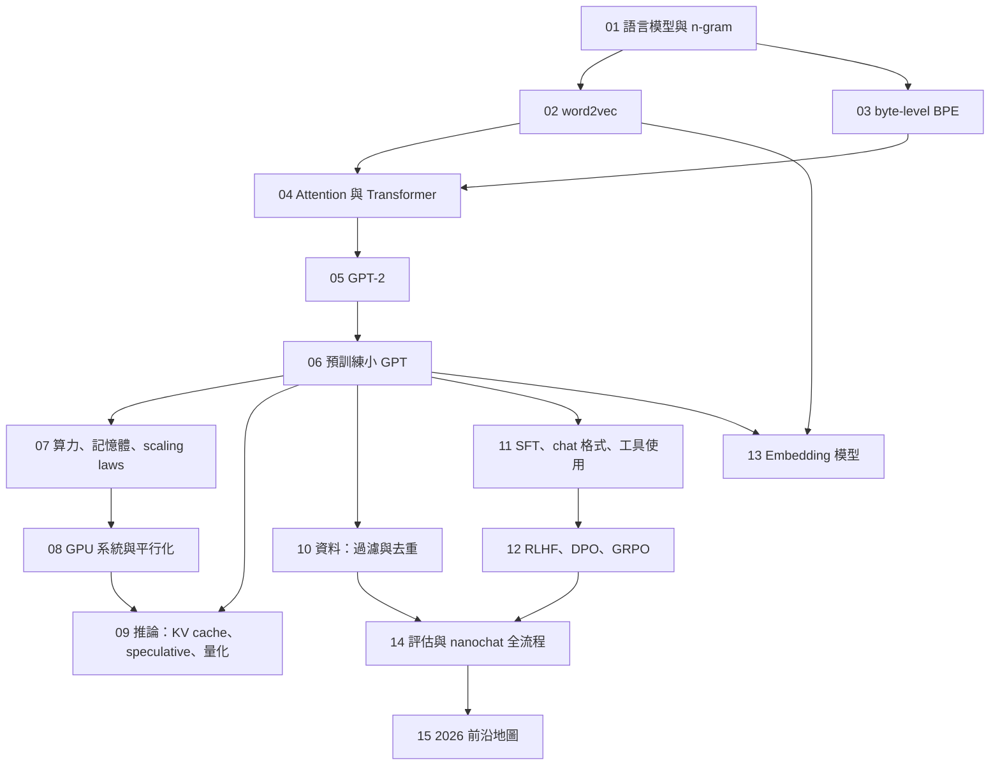

# 第 00 課：課程地圖與環境設定

> 撰寫日期：2026-09-25 ｜ 本課沒有實驗 ｜ 預估閱讀時間：20 分鐘

## 這門課要帶你走到哪裡

讀完、做完這門課，你應該能：

1. **從第一原理講清楚「語言模型」**：它是一個機率分布，訓練目標是交叉熵，評估用 perplexity 或 bits-per-byte，並知道這些數字怎麼互相換算。
2. **親手做出每一個零件**：word2vec、byte-level BPE、attention、RoPE、GPT-2、KV cache、Muon、FlashAttention 的分塊演算法、MinHash 去重、SFT 的 loss mask、GRPO、DPO、對比學習的 embedding 模型——全部在 `src/lm_course/` 裡有經過測試的參考實作。
3. **把 OpenAI 的 GPT-2 權重載進自己寫的模型**，而且 logits 和官方實作對得上。
4. **在筆電 CPU 上跑完一條迷你版的完整流程**：tokenizer → 預訓練 → SFT（含工具使用）→ 強化學習 → 拿同一個模型做 embedding。
5. **會算帳**：一個模型要多少 FLOPs、多少記憶體、該配多少資料（scaling laws），推論時的瓶頸在哪裡。
6. **看懂 2026 年的論文與開源專案**：nanochat 的每一個設計選擇、DeepSeek／Qwen 類模型的技術報告在講什麼。

## 五個來源，一門課

這門課整合了五個主題。它們重疊很多，所以沒有照來源分章，而是**照「做出一個語言模型的順序」重新排列**，重疊的地方只講一次：

| 來源 | 是什麼 | 在本課哪裡 |
|---|---|---|
| **word2vec**（Mikolov 等人 2013） | 詞向量的起點：用「猜鄰居」學出詞的向量 | 第 02 課；第 13 課回頭對照 |
| **GPT-2**（OpenAI 2019） | decoder-only Transformer 的經典配方、byte-level BPE | 第 03、04、05 課 |
| **Stanford CS336**〈Language Modeling from Scratch〉（Percy Liang、Tatsunori Hashimoto） | 從零打造 LM 的整條鏈：tokenizer、架構、訓練、資源計算、GPU 系統、平行化、scaling laws、推論、評估、資料、後訓練 | 第 01、03、04、06–12、14 課（課程骨幹） |
| **nanochat**（Andrej Karpathy，2025-10 起） | 在單一 8×GPU 節點上跑完整條 ChatGPT 流程的極簡實作 | 第 06（Muon、現代架構）、09（KV cache 引擎）、11（chat 格式、工具使用）、12（簡化 GRPO）、14（全流程導讀）課 |
| **Embedding 模型** | 把一段文字變成一個向量：對比學習、in-batch negatives、Matryoshka、LLM 當 backbone | 第 13 課 |

重疊在哪裡、怎麼處理：

- **BPE**：GPT-2、CS336 作業 1、nanochat（rustbpe）、Karpathy 的 minBPE 都是同一個演算法 → 第 03 課講一次，差別只在「切字的正規表示式」與詞彙量，用一張表比較。
- **Transformer 架構**：GPT-2（2019）→ CS336 講的「現代預設」（RMSNorm、RoPE、SwiGLU）→ nanochat 再往前走（ReLU²、QK-norm、logit soft-cap…）→ 用同一個可切換的 `GPTConfig` 實作，第 04–06 課逐一比較。
- **後訓練**：CS336 作業 5（SFT、數學推理的 RL、DPO）與 nanochat（SFT、GSM8K 上的簡化 GRPO）→ 第 11 課用同一個 SFT 模型學會講故事、加法（三種回答格式）與工具使用；第 12 課在「故事有沒有切題」上做 GRPO、KL 懲罰與 DPO，並說明為什麼加法題的 RL 在這個規模學不起來。
- **embedding**：word2vec 的「詞向量」與 GPT 的「token embedding 表」是同一種東西；第 13 課把預訓練好的 GPT 變成句子 embedding 模型，繞回起點。

## 課程地圖



四段：

- **基礎**（01–03）：語言模型的定義與評估、詞向量、tokenizer。
- **模型**（04–06）：attention 到 GPT-2，再到自己預訓練一個模型。
- **規模與效率**（07–10）：算帳、GPU、推論、資料——CS336 的重心。
- **後訓練與應用**（11–15）：chat 模型、強化學習、embedding、評估、前沿。

## 每一課長什麼樣

沿用本 repo 的「雙層講解」：

1. **白話版**：先用高中生聽得懂的比喻建立直覺。
2. **正式版**：定義與推導，公式有編號，都能在程式裡找到對應。
3. **對照程式碼**：指到 `src/lm_course/` 的哪個函式在做這件事。
4. **常見誤解**。
5. **練習**：「想一想」（紙筆）與「動手改」（改 notebook）。
6. **延伸閱讀**：一手來源為主，完整清單在 [`../references.md`](../references.md)。

## 建議的學習節奏

| 週 | 課 | 重點 |
|---|---|---|
| 1 | 00–03 | 機率與評估指標、word2vec、BPE（實驗都在 2 分鐘內） |
| 2 | 04–06 | Transformer、GPT-2、預訓練（Lab 06 約 40 分鐘，其中預訓練 27 分鐘，**後面四個實驗都要用它的模型**） |
| 3 | 07–10 | scaling laws、系統、推論、資料 |
| 4 | 11–15 | SFT、RL、embedding、評估、前沿 |

每課約 1.5–3 小時。第 02、07、12 課的推導建議拿紙筆跟著算。

## 先備知識

| 需要 | 程度 | 不熟怎麼辦 |
|---|---|---|
| Python、PyTorch | 會寫 `nn.Module` 與 training loop | repo 裡的 `deep-learning-karpathy/`（minBPE、nanoGPT 導讀）是很好的熱身 |
| 機率 | 條件機率、期望值、log 與 exp | 第 01 課會把需要的整理一次 |
| 線代與微積分 | 矩陣乘法、梯度、鏈鎖律 | 夠用即可 |
| 深度學習 | MLP、反向傳播、Adam | 第 06 課會補最佳化器 |

## 環境設定

照 repo 規則（`AGENTS.md` §5）：本子專案有自己的 `.venv`，套件由本人手動 `uv add`。
`pyproject.toml` 已把 `torch` 導向 PyTorch 的 CUDA 12.6 wheel 索引，Windows 與 Linux 用同一組指令：

```bash
cd language-models-course
uv add torch numpy matplotlib loguru regex ipykernel
uv add --dev pytest
uv run pytest                # 基線：全部測試應該通過（需要網路的測試會自動略過）
```

用 VS Code（或 Jupyter）打開 `notebooks/`，kernel 選本子專案的 `.venv`。

**會下載的東西**（都放在被 git 忽略的 `data/`，第一次用到才下載）：

| 檔案 | 大小 | 用在 | 授權 |
|---|---|---|---|
| TinyStories `TinyStoriesV2-GPT4-valid.txt` | 22.5 MB | 幾乎所有實驗 | CDLA-Sharing-1.0 |
| GPT-2 124M 的 `vocab.json`、`merges.txt` | 1.5 MB | Lab 03、05 | Modified MIT |
| GPT-2 124M 的 `model.safetensors` | 548 MB | Lab 05 | Modified MIT |

**硬體**：所有實驗都能在 CPU 上跑。notebook 裡的輸出是在 4 核心雲端 CPU 上實跑的結果；最久的是 Lab 07（IsoFLOP 實驗約 80 分鐘，只跑前兩個預算約 25 分鐘）與 Lab 06（約 40 分鐘，其中預訓練 27 分鐘），其次是 Lab 13（約 23 分鐘）與 Lab 11（約 18 分鐘），其餘都在 10 分鐘內。有 GPU 就把 notebook 開頭的步數調大，或用 `scripts/pretrain.py` 做更長的訓練。

## 程式碼怎麼讀

`src/lm_course/` 是整門課的參考實作，每個 notebook 都 import 它。三個設計重點：

- **一個可切換的 GPT**：`model.GPT` 用 `GPTConfig` 的開關切換 LayerNorm／RMSNorm、learned／RoPE、GELU／SwiGLU／ReLU²、MHA／GQA、tied／untied；`gpt2_config`、`llama_style_config`、`nanochat_style_config` 是三組預設。
- **共用的「課程資產」**（`artifacts.py`）：Lab 03 訓練的 tokenizer（4096 個 token，含 chat 用的特殊 token）、切好的 TinyStories、Lab 06 預訓練的 base model，後面的實驗都從這裡拿。
- **測試是拿答案對答案**：例如「SGNS 的最佳解是 shifted PMI」、「tiled attention 與標準 attention 完全相等」、「speculative decoding 抽出的分布就是目標模型的分布」、「載入的 GPT-2 logits 與 Hugging Face 相同」。讀測試也是一種學習。

## 授權、出處與學術誠信

- **程式與講義都是為本課撰寫的**，依論文公式與課程公開的題目描述自行實作，沒有複製任何來源的程式碼。nanochat（MIT）、nanoGPT（MIT）、CS336 作業 repo（MIT，Stanford 版權）的設計會被引用與討論，但沒有貼上它們的程式碼。
- CS336 的**講義 PDF 沒有附授權**，因此本課只提供連結、不轉載任何內容。
- **如果你正在修 CS336**：課程的 honor code 要求作業不參考外部既有程式碼。本 repo 是公開的教學實作，介面與作業不同，但請依你所修課程的規定決定能不能看。
- 資料集與模型權重在執行時下載，不放進 repo；授權與標示見 [`../NOTICE.md`](../NOTICE.md)。
