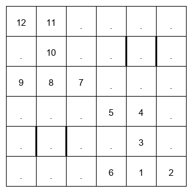

# LinkedIn Zip Puzzle Solver Challenge

The LinkedIn "Zip" puzzle, taken end to end: **make** a board, **read** one out of a
screenshot, and **solve** it. One FastAPI application serves all three, with a Gradio console
and a Svelte canvas editor on top, and the whole stack starts with a single command.

Two of those three pieces are learned. A **fine-tuned vision-language model** turns a
screenshot into a board — that is the reading step, not a solver. Solving itself is done two
ways, and comparing them is the point of the project: **classical search** (an exact
constraint solver among others) against a **neural policy trained by imitation** that plays
the board move by move.

The exact solver already wins on speed and correctness, so what the learned solver is really
for is to find out *where learning helps, where it does not, and how you would know*. The
measurements that answer that — including the ones that refuted our own hypotheses — are in
[`ai-collab/`](./ai-collab/).

---

## About the "Zip" puzzle

Draw a single continuous path that visits every open cell exactly once.

*   The path covers every visitable cell, and no cell is visited twice.
*   It must pass through the numbered waypoints in ascending order (1 → 2 → 3 …).
*   It cannot cross a wall (drawn as `|` or `—`).

Formally this is a **Hamiltonian path with ordering constraints** — NP-hard in general, which
is exactly why comparing an exact solver against learned ones is interesting on a board this
small.



---

## Quick start

From a fresh clone to a running service:

```bash
git clone https://github.com/Hero0963/ml-workshop.git
cd ml-workshop/linkedin-zip-challenge
python start.py
```

`start.py` needs nothing but Python 3 and a running Docker. It creates `.env` from the
template, builds the images, brings the stack up, **waits until the API actually answers**, and
then tells you what works and what does not:

```
$ docker compose -f docker-compose.yml up -d --build
Waiting for http://127.0.0.1:7440/api/echo/health
API is up.
Ollama is up. Models: ['zip-qwen35-4b-p4c:f16', ...]
RL solver weights found (models/rl_a2/bc_multi_456/checkpoints/model_final.zip).

  Gradio console   http://127.0.0.1:7440/ui
  Svelte editor    http://127.0.0.1:7440/svelte-ui/
  API docs         http://127.0.0.1:7440/docs
```

| Command | What it does |
|---|---|
| `python start.py` | Production stack: code baked into the image |
| `python start.py --dev` | Development stack: hot reload plus the Svelte dev server on `:5173` |
| `python start.py --status` | What is running, and which optional pieces are missing |
| `python start.py --down` | Stop and remove the containers |

**The first build downloads several GB and takes 10–15 minutes.** After that, start-up is
about two minutes.

**Two things are optional and degrade honestly if absent.** Without the Ollama container the
screenshot reader is unavailable and everything else works; without a trained checkpoint under
`models/` the learned solver answers `503` and the exact solvers are unaffected. `start.py`
says which of the two you are missing instead of letting you discover it later.

An operator's guide — what each container is for, the five acceptance checks with their real
output, and how to diagnose a failure — is in
[`ai-collab/deployment-guide.md`](./ai-collab/deployment-guide.md) (Traditional Chinese).

---

## What's in the box

### 1. Make a puzzle

Procedural generation that draws a Hamiltonian path first and then carves the puzzle out of
it, so every generated board is solvable by construction. Available from the Gradio console,
the Svelte editor, and as a deterministic dataset generator
(`src/core/rl/generate_dataset_v2.py`) that keeps the solution path with each puzzle — which
is what made imitation learning possible.

### 2. Read a puzzle from a screenshot

`POST /api/vision/solve` takes an image, a fine-tuned vision-language model turns it into a
board, and a solver solves it. The response carries **warnings** and a **`solvable`** flag
rather than only an answer, because a misreading is the failure mode that matters and those
two fields are how you notice it. See [The two models](#the-two-models).

### 3. Solve it

`POST /api/solver/solve` takes a board and a solver name. Ten solvers are implemented; four
are wired into the API today.

---

## The solvers

Every solver lives in `src/core/solvers/` and shares one puzzle representation
(`src/core/utils.py`). The list served by the API, the screenshot endpoint and the Gradio
dropdown comes from a single registry (`src/core/solvers/registry.py`).

| Solver | Kind | Served today | Notes |
|---|---|---|---|
| **CP-SAT** | exact | yes | Constraint solver. Fastest and always right — the default. |
| **DFS** | exact | yes | Depth-first with pruning. |
| **A\*** | exact | yes | Best-first over the same space. |
| **RL (behaviour cloning)** | learned | yes | A neural policy. Not exact, not guaranteed — see below. |
| Ant Colony Optimization | metaheuristic | — | Implemented and tested, not exposed. |
| Genetic Algorithm | metaheuristic | — | " |
| Particle Swarm Optimization | metaheuristic | — | " |
| Simulated Annealing | metaheuristic | — | " |
| Tabu Search | metaheuristic | — | " |
| Monte Carlo | metaheuristic | — | " |

The six metaheuristics are deliberately not exposed: on a board this small they lose to CP-SAT
on every axis, and wiring them up is tracked as a known, deprioritised item rather than an
oversight.

---

## The two models

### Vision: reading a board out of a screenshot

| | |
|---|---|
| **Model chosen** | **Qwen3.5-4B**, Q8, fine-tuned with LoRA and served by Ollama as `zip-qwen35-4b-p4c:f16` |
| **Why this one** | It had an official fine-tuning notebook and a realistic chance of fitting; 4B at Q8 loads fully onto a 16 GB card with no CPU offload (peak 9.6 GB). Q4 of the same model **could not emit valid JSON at all** — quantisation mattered more than size. |
| **How it was trained** | Synthetic screenshots rendered from generated puzzles, LoRA on a Colab L4: **975 steps, 1.56 h, ~42% MFU**, peak VRAM 20.9 of 22.0 GiB. Merged into the base model, converted to GGUF, imported into Ollama. |
| **What it fixed** | The un-finetuned bottleneck was **walls, and only walls**: layout 0.947 and numbers 0.917 on real screenshots, but **wall F1 0.438** and 2/6 end to end. After fine-tuning, wall F1 on walled held-out puzzles is **1.000** and end-to-end is **200/200**. |
| **Export cost** | Zero: the same 200 held-out images produce **byte-identical** output locally and on Colab, and **6.5× faster** (34.5 s → 5.3 s per image). |

⚠ The held-out set is **synthetic**, and its metrics are saturated at 1.000 — it can no longer
tell two approaches apart. Making the evaluation harder is the next step for that track, not
making the model bigger.

⚠ The model tag and the prompt variant **must match** (`VISION_PROMPT_VARIANT=finetune` with
the fine-tuned tag). Pairing the fine-tune prompt with an un-finetuned model asks it a question
it never saw, and the failure is quiet: a `200` response containing an empty board.

### Reinforcement learning: playing the puzzle move by move

The environment is a one-stroke walk: the observation is eight 8×8 feature planes plus a short
scalar vector, the action is one of four directions, and illegal moves are removed by an action
mask before the policy ever sees them. Reward is frozen-lake style — `+1` for solving, nothing
otherwise.

| | |
|---|---|
| **Model** | Three padded 3×3 convolutions (64 channels, no pooling) → 256-d features → policy and value heads. **1.17 M parameters**, of which 89.7% are the flattening layer. |
| **How it is trained today** | **Behaviour cloning.** Every generated puzzle ships with its solution, so ~1.17 M `(board, next move)` pairs are a supervised dataset. Masked cross-entropy, 10 epochs, batch 512 — **7.8 minutes on one GPU**. |
| **What it replaced** | MaskablePPO with a reverse curriculum: 8 M steps and ~2,000 s, and it **lost** to 7.8 minutes of supervised training on every board and every inference setting. |
| **One model, three boards** | **A single policy serves 4×4, 5×5 and 6×6 — the goal, and it holds up.** Against size-specific controls trained on the same data it is better on a single deterministic run (+0.032 to +0.037 on every board), level under a best-of-32 budget, **cheaper at inference on every board**, and slightly cheaper to train than the three controls together. 5×5 had no model at all before this. |

**Results** (held-out test, 1,931 / 2,001 / 2,000 puzzles). *Best-of-32* means: sample up to 32
full attempts and keep the first that verifies — legitimate here because a Zip solution checks
itself. Attempts stop at the first success, so the average cost is far below 32.

| Board | Greedy baseline | Policy, single deterministic run | Policy, best-of-32 | Attempts used |
|---|---|---|---|---|
| 4×4 | 0.1156 | 0.9404 | **0.9917** | 1.55 |
| 5×5 | 0.0346 | 0.7496 | **0.9495** | 3.59 |
| 6×6 | 0.0046 | 0.5205 | **0.8535** | 7.76 |

**What this actually says.** The policy is roughly **8× the greedy baseline on 4×4 and 110× on
6×6**, and with a small inference budget it solves most boards — but it is neither exact nor
guaranteed, and CP-SAT beats it on both counts. The honest summary of the track is that
**this problem barely needs reinforcement learning**: rewards are extremely sparse, perfect
demonstrations are free, solutions verify themselves, and after masking the mean branching
factor is 1.5 — so the three things RL is good at are all things this puzzle does not need.
Knowing when *not* to reach for RL is the most solid result the track produced.

The measured bottleneck is stated precisely rather than hand-waved: 6×6 needs about
**14 real choices** per board, the policy is right **93.9%** of the time per choice, and
`0.939 ^ 14.22 = 0.409` — which is the deterministic solve rate to three decimals. Clearing
0.85 deterministically would need **98.9%** per choice, a 5.4× cut in error rate. Every
proposed improvement gets checked against that number first.

Full write-up: [`ai-collab/reports/2026-09-12_rl-wrap-up.md`](./ai-collab/reports/2026-09-12_rl-wrap-up.md).
Concepts explained from scratch — behaviour cloning, DAgger, PPO fine-tuning, AlphaZero-style
self-improvement — in [`ai-collab/notes/`](./ai-collab/notes/).

---

## Project structure

```
linkedin-zip-challenge/
├── start.py                  # One command from a fresh clone to a running stack
├── docker-compose.yml        # Production stack (app + ollama)
├── docker-compose.dev.yml    # Development stack (+ hot reload, Svelte dev server)
├── .devcontainer/
│   ├── Dockerfile            # Multi-stage: Svelte build, then the Python app
│   └── Dockerfile.dev        # Development image (uvicorn --reload)
├── .env.example              # Configuration template; `.env` is created from it
│
├── src/
│   ├── app/                  # FastAPI application
│   │   ├── main.py           # App, CORS, static mounts, Gradio mount
│   │   ├── routers/          # echo / solver / vision endpoints
│   │   └── schemas/          # Request and response models
│   ├── core/
│   │   ├── solvers/          # Nine classical solvers + the shared registry
│   │   ├── puzzle_generation/# Procedural generator (path first, then carve)
│   │   ├── vl_models/        # Screenshot → board: prompts, backends, scoring
│   │   ├── rl/               # Environment, training, and the serving adapter
│   │   │   ├── rl_env_v2.py            # The environment: masking, rewards, curriculum
│   │   │   ├── train_behaviour_cloning.py
│   │   │   ├── train_maskable_ppo.py
│   │   │   ├── train_config.py         # Every training knob lives here
│   │   │   └── solver_service.py       # The only serving-side file
│   │   ├── tests/            # Core, solver, RL and generation tests
│   │   └── utils.py          # Puzzle type, parser, fitness, visualisation
│   ├── ui/gradio_app.py      # Gradio console (an adapter over the API)
│   ├── custom_components/    # Svelte canvas editor (source + build)
│   └── settings.py           # The single source of configuration
│
├── ai-collab/                # Development documentation (see below)
├── illustrations/            # Screenshots and sample puzzles
├── models/  datasets/  logs/ # Large local artifacts — not in version control
└── pyproject.toml            # Dependencies, pinned via uv.lock
```

---

## Running it without Docker

```bash
cd linkedin-zip-challenge
uv sync                                     # Python 3.11, pinned by .python-version
cp .env.example .env
uv run python -m src.app.main               # http://127.0.0.1:7440/ui
```

The Svelte editor needs a build before it appears at `/svelte-ui`:

```bash
cd src/custom_components/puzzle_editor/frontend && npm install && npm run build
```

Screenshot reading needs an Ollama serving the vision model; `.env`'s `OLLAMA_PROVIDER_URL`
points at the port the compose stack publishes, so running just that container is enough.

---

## Using the console

The Gradio console at `/ui` has one tab per capability:

*   **Generate Puzzle** — create a random board, optionally with blocked cells.
*   **Puzzle Solver (Naive)** — paste a layout and walls as text.
*   **Puzzle Solver (Interactive)** — a canvas editor: click cells to add waypoints, obstacles
    and walls, then solve.
*   **Solve from Screenshot** — upload an image; the answer carries warnings and a `solvable`
    flag alongside the solution.
*   **Echo Test** — confirm the backend is responsive.

Screenshots are in [`illustrations/`](./illustrations/).

---

## Development

```bash
cd linkedin-zip-challenge
uv sync
uv run pytest            # 276 passed, 8 xfailed as of 2026-09-12
uv run ruff check .
```

The eight `xfail`s are deliberate: they pin defects in the retired v1 environment, so an
unexpected pass means someone changed it.

### Documentation map

| Document | What it holds |
|---|---|
| [`ai-collab/roadmap.md`](./ai-collab/roadmap.md) | Current status, next steps, settled decisions. **Start here.** |
| [`ai-collab/project_guide.md`](./ai-collab/project_guide.md) | Architecture, module responsibilities, how to run each environment |
| [`ai-collab/deployment-guide.md`](./ai-collab/deployment-guide.md) | Docker: what each container does, acceptance checks, troubleshooting |
| [`ai-collab/notes/`](./ai-collab/notes/) | Concepts explained: what the methods are, how to read the numbers, how inference works |
| [`ai-collab/reports/`](./ai-collab/reports/) | One report per experiment — method, numbers, and what was refuted |
| [`ai-collab/handover-rl-solver.md`](./ai-collab/handover-rl-solver.md) | Picking up the RL track: dead ends with evidence, what to do next |
| [`ai-collab/handover-vlm-parser.md`](./ai-collab/handover-vlm-parser.md) | Picking up the vision track |
| [`ai-collab/dev_log.md`](./ai-collab/dev_log.md) | Full chronological history (long — search it, don't read it) |
| [`AGENTS.md`](./AGENTS.md) | Working agreement for this sub-project (human or AI) |

A Traditional Chinese overview is in [`README_zh-TW.md`](./README_zh-TW.md).

---

## What's next

*   **Fine-tune the policy with PPO from the cloned weights.** It is the one experiment that
    could overturn "this problem does not need RL", and the blocker — whether training a value
    head costs policy quality — was measured and cleared.
*   **Make the vision evaluation harder.** The synthetic held-out set is saturated at 1.000;
    visual noise, several renderer styles and larger boards would restore its power to
    discriminate.
*   **Expose the six metaheuristic solvers** through the API for a like-for-like comparison.
