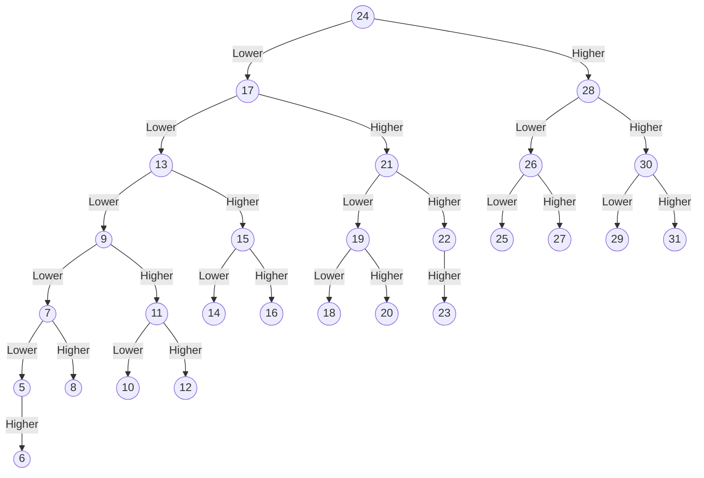

# Decision Tree Visualization

Range: **[5, 31]**

Minimax Cost: **84**

```mermaid
graph TD;
    N24(("24"))
    N24_17(("17"))
    N24 -->|Lower| N24_17
    N24_17_13(("13"))
    N24_17 -->|Lower| N24_17_13
    N24_17_13_9(("9"))
    N24_17_13 -->|Lower| N24_17_13_9
    N24_17_13_9_7(("7"))
    N24_17_13_9 -->|Lower| N24_17_13_9_7
    N24_17_13_9_7_5(("5"))
    N24_17_13_9_7 -->|Lower| N24_17_13_9_7_5
    N24_17_13_9_7_5_L6(("6"))
    N24_17_13_9_7_5 -->|Higher| N24_17_13_9_7_5_L6
    N24_17_13_9_7_L8(("8"))
    N24_17_13_9_7 -->|Higher| N24_17_13_9_7_L8
    N24_17_13_9_11(("11"))
    N24_17_13_9 -->|Higher| N24_17_13_9_11
    N24_17_13_9_11_L10(("10"))
    N24_17_13_9_11 -->|Lower| N24_17_13_9_11_L10
    N24_17_13_9_11_L12(("12"))
    N24_17_13_9_11 -->|Higher| N24_17_13_9_11_L12
    N24_17_13_15(("15"))
    N24_17_13 -->|Higher| N24_17_13_15
    N24_17_13_15_L14(("14"))
    N24_17_13_15 -->|Lower| N24_17_13_15_L14
    N24_17_13_15_L16(("16"))
    N24_17_13_15 -->|Higher| N24_17_13_15_L16
    N24_17_21(("21"))
    N24_17 -->|Higher| N24_17_21
    N24_17_21_19(("19"))
    N24_17_21 -->|Lower| N24_17_21_19
    N24_17_21_19_L18(("18"))
    N24_17_21_19 -->|Lower| N24_17_21_19_L18
    N24_17_21_19_L20(("20"))
    N24_17_21_19 -->|Higher| N24_17_21_19_L20
    N24_17_21_22(("22"))
    N24_17_21 -->|Higher| N24_17_21_22
    N24_17_21_22_L23(("23"))
    N24_17_21_22 -->|Higher| N24_17_21_22_L23
    N24_28(("28"))
    N24 -->|Higher| N24_28
    N24_28_26(("26"))
    N24_28 -->|Lower| N24_28_26
    N24_28_26_L25(("25"))
    N24_28_26 -->|Lower| N24_28_26_L25
    N24_28_26_L27(("27"))
    N24_28_26 -->|Higher| N24_28_26_L27
    N24_28_30(("30"))
    N24_28 -->|Higher| N24_28_30
    N24_28_30_L29(("29"))
    N24_28_30 -->|Lower| N24_28_30_L29
    N24_28_30_L31(("31"))
    N24_28_30 -->|Higher| N24_28_30_L31
```