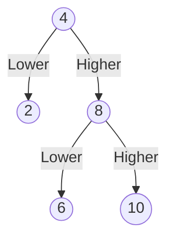

# Minimax Strategy Tree (Discrete)

Set: **[2, 4, 6, 8, 10]**

Minimax Cost: **12**

```mermaid
graph TD;
    N4(("4"))
    N4_L2(("2"))
    N4 -->|Lower| N4_L2
    N4_8(("8"))
    N4 -->|Higher| N4_8
    N4_8_L6(("6"))
    N4_8 -->|Lower| N4_8_L6
    N4_8_L10(("10"))
    N4_8 -->|Higher| N4_8_L10
```